###

<h1 align="center">Full Stack Developer expertised in Blockchain </h1>

  <h2>
    
      How to reach me
    
  </h2>
  
  

    
    &nbsp;&nbsp;
    
    &nbsp;&nbsp;
    
  

###

<h2 align="center">About me</h2>

  

###

<h2 align="center">Languages</h2>

  

###

###

<h2 align="center">Frameworks and Libraries</h2>

###

  

###

<h2 align="center">Services</h2>

  

###

<h2 align="center">Databases</h2>

  

###

<h2 align="center">Development Tools</h2>

  

###

<h2 align="center">Collaborate</h2>

  

###